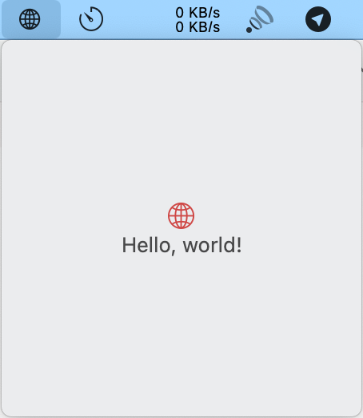

使用SwiftUI创建macOS状态栏图标应用

# 需求

需要给应用在状态栏上创建一个图标，并可以点击打开UI。

# 步骤

## 创建下拉菜单栏对象 [^3] [^1] [^2]

```swift
class AppMenuBar: NSObject {
    let menu = NSMenu()
}

extension AppMenuBar {
    func createMenu() -> NSMenu {
        let menuView =
        VStack {
            Image(systemName: "globe")
                .imageScale(.large)
                .foregroundColor(.accentColor)
            Text("Hello, world!")
        }
        .padding()
        
        let topView = NSHostingController(rootView: menuView)
        topView.view.frame.size = CGSize(width: 225, height: 225)
        let menuItem = NSMenuItem()
        menuItem.view = topView.view
        menu.addItem(menuItem)
        menu.addItem(NSMenuItem.separator())
        return menu
    }
}
}
```

## 在App delegate中创建状态栏图标，设置下拉菜单 [^4] [^5]

```swift
class AppDelegate: NSObject, NSApplicationDelegate {
    static private(set) var instance: AppDelegate!
    //设置状态栏变量
    lazy var statusBarItem = NSStatusBar.system.statusItem(withLength: NSStatusItem.variableLength)
    //设置状态栏下拉菜单变量
    let menu = AppMenuBar()
    
    func applicationDidFinishLaunching(_ notification: Notification) {
        //初始化配置状态栏与菜单
        setStatusBar()
    }
}
extension AppDelegate {
    func setStatusBar() {
        AppDelegate.instance = self
        
        statusBarItem.button?.image = NSImage(systemSymbolName: "globe", accessibilityDescription: nil)
        statusBarItem.button?.imagePosition = .imageLeading
        statusBarItem.menu = menu.createMenu()
    }
}
```

## 在App中注入delegate流程，完成状态栏图标和下拉菜单的设置 [^6] [^5]

```swift
@main
struct MenuBarApp: App {
    //注入app delegate流程中初始化状态栏与菜单
    @NSApplicationDelegateAdaptor(AppDelegate.self) var appDelegate
    var body: some Scene {
        Settings {
            EmptyView()
        }
    }
}
```

# 效果




[^1]: [kyan_bar/MainMenu.swift at master · kyan/kyan_bar](https://github.com/kyan/kyan_bar/blob/master/KyanBar/MainMenu.swift)
[^2]: [Building a macOS Menu Bar App - The Dad Jokes Series (Part 1) - YouTube](https://www.youtube.com/watch?v=CuMLpnjPr2Y)
[^3]: [MenuBar/AppMenuBar.swift at main · hesperhu/MenuBar](https://github.com/hesperhu/MenuBar/blob/main/MenuBar/AppMenuBar.swift)
[^4]: [MenuBar/AppDelegate.swift at main · hesperhu/MenuBar](https://github.com/hesperhu/MenuBar/blob/main/MenuBar/AppDelegate.swift)
[^5]: [kyan_bar/KyanBarApp.swift at master · kyan/kyan_bar](https://github.com/kyan/kyan_bar/blob/master/KyanBar/KyanBarApp.swift)
[^6]: [MenuBar/MenuBarApp.swift at main · hesperhu/MenuBar](https://github.com/hesperhu/MenuBar/blob/main/MenuBar/MenuBarApp.swift)
